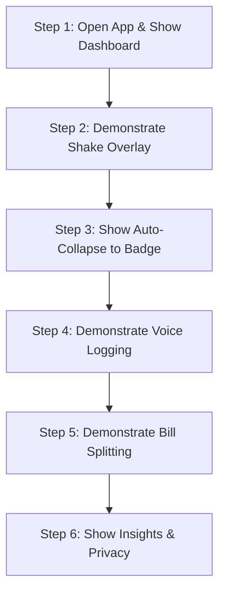

# ARTHIX (Shake & Audit) — Complete Project Walkthrough & Presentation Guide

> **For Presenters:** This document contains everything you need to understand, explain, and demo the ARTHIX project with confidence, even if you are presenting it for the very first time.

---

## 📑 Table of Contents
1. [Executive Summary & The 30-Second Elevator Pitch](#1-executive-summary--the-30-second-elevator-pitch)
2. [The Problem: Why Traditional Expense Trackers Fail](#2-the-problem-why-traditional-expense-trackers-fail)
3. [The Solution: How ARTHIX Works](#3-the-solution-how-arthix-works)
4. [Core Features & Multimodal Capture Methods](#4-core-features--multimodal-capture-methods)
5. [System Architecture & Innovation Deep-Dive](#5-system-architecture--innovation-deep-dive)
6. [Step-by-Step Live Demo Runbook (What to Do on Screen)](#6-step-by-step-live-demo-runbook-what-to-do-on-screen)
7. [Word-for-Word Presentation Script ("What to Say")](#7-word-for-word-presentation-script-what-to-say)
8. [Technical Q&A / Judges' Cheatsheet](#8-technical-qa--judges-cheatsheet)
9. [Tech Stack Summary](#9-tech-stack-summary)

---

## 1. Executive Summary & The 30-Second Elevator Pitch

**What is ARTHIX?**
> **ARTHIX** is an AI-powered, zero-typing personal finance tracker built specifically for India’s high-frequency UPI economy. 
> Instead of opening an app and manually typing expenses, users simply **give their phone a quick double-shake right after paying on Google Pay, PhonePe, or Paytm**. 
> A sleek floating overlay appears on top of the payment app for 5 seconds. The user taps a single category (like *Food* or *Travel*), and ARTHIX’s on-device **Reconciliation Engine** automatically fuses the gesture with the incoming bank SMS/UPI alert to log the exact verified transaction in **under 1 second**.

### Key Highlights
- ⚡ **Zero-Typing Shake-to-Log**: Under 3 seconds to log any expense.
- 🎙️ **Voice AI Logging**: Natural speech input (e.g., *"Spent 250 on lunch with Rohan"*).
- 📷 **Receipt Camera OCR**: On-device machine learning receipt text extraction.
- 👥 **Built-in Bill Splitting**: Splitwise-style group bill splitting with zero friction.
- 🔥 **Budget Streaks & Gamification**: Habit-building financial streak tracker.
- 🔒 **100% On-Device & Private**: Zero cloud leakage, SQLCipher-encrypted database, zero bank logins required.

---

## 2. The Problem: Why Traditional Expense Trackers Fail

1. **High Friction / 90% Abandonment Rate:**
   Traditional apps require users to unlock their phone, open the app, tap `+`, type ₹150, search for a category, type a note, and hit save. Nobody does this for 5–10 daily micro-transactions (chai, auto, groceries).
2. **Bank Notifications Lack Context:**
   Automated SMS parsers know *how much* you spent, but never *why* you spent it. A UPI transaction to `merchant9482@icici` tells you nothing about whether it was groceries, dinner, or medicine.
3. **The Notification Contention Flaw:**
   Existing smart assistants try to post category buttons in the Android notification tray. But when you pay, 3–4 bank and UPI alerts arrive simultaneously, burying the prompt immediately.
4. **Privacy & Data Exploitation:**
   Most popular expense apps upload your SMS and financial history to third-party cloud servers to sell ads or credit products.

---

## 3. The Solution: How ARTHIX Works

ARTHIX flips the script with **Deterministic Core + Gesture Accelerant**:

```
 ┌───────────────────────────┐         ┌───────────────────────────┐
 │   PHYSICAL SHAKE GESTURE  │         │   OFFICIAL UPI / SMS NOTIF│
 │  (Intent & Fast Category) │         │    (Authoritative Amount) │
 └─────────────┬─────────────┘         └─────────────┬─────────────┘
               │                                     │
               ▼                                     ▼
   [FLOATING SYSTEM OVERLAY]             [NOTIFICATION LISTENER]
  (Category chip tapped in 1s)         (Exact ₹ and Payee verified)
               │                                     │
               └──────────────────┬──────────────────┘
                                  │
                                  ▼
                ┌───────────────────────────────────┐
                │   EVENT RECONCILIATION ENGINE     │
                │  - Symmetric nearest-neighbor     │
                │  - 120-second correlation window  │
                │  - Disambiguation & Dedup         │
                └─────────────────┬─────────────────┘
                                  │
                                  ▼
                 [VERIFIED ENRICHED TRANSACTION]
```

- **The Notification is Authoritative:** It guarantees 100% mathematical accuracy (exact rupees and paise).
- **The Shake is the Accelerant:** It supplies human intent and category without needing to open the app.
- **Symmetric Matching:** Whether you shake *before* paying or *after* paying, the Reconciliation Engine pairs them seamlessly within a 120-second window.

---

## 4. Core Features & Multimodal Capture Methods

### 1. Shake-to-Log & Floating System Overlay
- **Instant Category Prompt:** On shake detection, a floating `SYSTEM_ALERT_WINDOW` appears directly above GPay/PhonePe.
- **5-Second Countdown Bar:** Shows 4 prominent category chips: `Food`, `Travel`, `Shopping`, `Other`.
- **Auto-Collapse to Persistent Badge:** If not tapped within 5s, the prompt collapses into an edge-docked glowing pill (`⚡ Categorize`) rather than disappearing. Tapping it anytime re-expands the chips.
- **Tactile Haptic Feedback:** Instant vibration pulse confirms gesture registration before the user even looks at the screen.

### 2. Bounded Background Capture Window (`CaptureGraceWindowService`)
- Running accelerometer sensors 24/7 drains battery.
- ARTHIX uses an on-demand, bounded foreground service: starts a **10-second grace window** on shake/app backgrounding, extendable at most once up to **120 seconds** upon activity, then self-terminates to ensure **zero continuous battery drain**.

### 3. Voice AI Capture
- Speak naturally: *"Split 800 rupees dinner bill with Vikram and Ananya"* or *"Paid 120 for auto"*.
- Built with on-device speech processing that extracts **Amount**, **Payee**, **Category**, and **Split Participants** automatically.

### 4. Receipt Camera OCR
- Point camera at any thermal or paper merchant bill.
- Uses on-device Google ML Kit Vision to extract line items, merchant name, date, and final total.

### 5. Smart Bill Splitting & Group Settlement
- Integrated directly into the expense stream.
- Supports Equal, Percentage, and Custom amount splits with friends.
- Keeps track of who owes what and auto-generates settlement links.

### 6. Budget Streaks & Financial Insights
- Gamified daily spending streak counter.
- Visual budget rings with category-level breakdowns and weekly trend charts.
- Export clean monthly financial summary reports.

---

## 5. System Architecture & Innovation Deep-Dive

### Architectural Highlights

| Layer | Technology | Key Responsibility |
|---|---|---|
| **UI Framework** | Jetpack Compose (Material3 + Custom Stitch DNA) | Sleek dark-mode aesthetic (`#0B0B0D`), glassmorphism, responsive micro-animations |
| **Local Database** | Room Database + SQLCipher | AES-256 encrypted on-device SQLite database |
| **Dependency Injection** | Dagger Hilt | Clean modular architecture across repositories, services, viewmodels |
| **Sensor Engine** | Linear Acceleration + Custom Oscillation Filter | Monotonic clock sampling (`elapsedRealtime`), debouncing, jerk-filter |
| **System Overlay** | `WindowManager` + `TYPE_APPLICATION_OVERLAY` | Standalone Compose ViewTree hosted outside Activity lifecycle |
| **Ingestion Router** | `NotificationListenerService` + `BroadcastReceiver` | Real-time UPI & SMS regex parsing for GPay, PhonePe, Paytm, HDFC, SBI, ICICI |

---

## 6. Step-by-Step Live Demo Runbook (What to Do on Screen)

Follow these exact steps when demonstrating the project:



### Step 1: Open App & Show Dashboard (15 seconds)
1. Launch ARTHIX. Show the dark-slate dashboard.
2. Point out the **Today's Spend Balance**, the **Budget Streak Flame**, and the **Recent Transactions Feed**.
3. Highlight the 1-tap permission banner ("Display Over Other Apps").

### Step 2: Demonstrate Shake-to-Log (30 seconds)
1. Switch out of ARTHIX to the home screen or open Google Pay / PhonePe.
2. **Give the phone a double-shake.**
3. Point to the screen: The **glowing 4-category bar** floats directly over the screen with a 5-second countdown timer.
4. Tap **"Food"**. Show that the overlay smoothly dismisses with haptic confirmation.
5. Re-open ARTHIX: Show the newly logged transaction confirmed instantly.

### Step 3: Demonstrate Auto-Collapse into Floating Badge (20 seconds)
1. Shake the phone again.
2. **Do not tap any category for 5 seconds.**
3. Show how the bar smoothly collapses into the compact floating pill badge docked at the edge (`⚡ Categorize`).
4. Tap the pill: Show it immediately re-expanding back into the full category selector!

### Step 4: Demonstrate Voice Logging (20 seconds)
1. Tap the **Microphone** button on the home screen.
2. Say clearly: *"Paid two hundred and fifty rupees for coffee with Priya"*.
3. Show the instant extraction: Amount = ₹250, Category = Food, Payee = Priya. Tap Save.

### Step 5: Demonstrate Bill Splitting (20 seconds)
1. Tap the **Splits** tab.
2. Tap "+ New Split" or tap any transaction to split.
3. Show the participant chips, equal split calculation, and instant balance update.

### Step 6: Show Privacy & Security (15 seconds)
1. Navigate to **Account → Privacy & Security**.
2. Show that all database tables are encrypted with SQLCipher and no remote server sync is required.

---

## 7. Word-for-Word Presentation Script ("What to Say")

Use this ready-to-read script for your presentation:

---

### **[0:00 - 0:45] The Hook & The Problem**
> *"Good morning/afternoon everyone. Today, UPI in India handles over 14 billion transactions every month. From our morning tea to dinner with friends, we pay using our phones multiple times a day.*
> 
> *Yet, 90% of people who download expense trackers stop using them within two weeks. Why? Because the friction of manual entry is simply too high. You pay 30 rupees for an auto, and you're not going to stop on the road, open an app, type numbers, and select a category.*
> 
> *Automated SMS parsers try to solve this, but they lack human context — your bank SMS tells you that you paid 'merchant-qr-72', but it has no idea if that was groceries, lunch, or medicine.*
> 
> *We built **ARTHIX** to solve this once and for all: **zero typing, sub-3-second capture, and 100% on-device privacy.**"*

---

### **[0:45 - 2:00] The Solution & Live Demo**
> *"Let me show you our primary innovation: **Shake-to-Log**.*
> 
> *Imagine I just scanned a QR code and paid for dinner on Google Pay. The moment I see the payment screen, I simply give my phone a quick double-shake... [Perform Shake].*
> 
> *Notice what happened: An instant haptic vibration confirms my gesture, and an overlay floats right here on top of Google Pay. It doesn't get buried by incoming bank notifications because it's rendered on its own dedicated system window layer.*
> 
> *I have 4 simple category chips right under my thumb. I tap 'Food'. In the background, our **Event Reconciliation Engine** captures the official bank notification, matches it with my 'Food' selection, and records the verified transaction in under one second.*
> 
> *What if I'm busy putting my wallet away and don't tap immediately? Watch this: After 5 seconds, the overlay automatically collapses into a persistent glowing pill badge on the side of my screen. It never gets lost. Whenever I'm free, I tap the badge, and it expands right back.*
> 
> *And to protect battery life, our background sensor service runs on a bounded 10-second grace window that automatically self-terminates, ensuring zero continuous battery drain."*

---

### **[2:00 - 3:00] Multimodal Inputs & Fintech Ecosystem**
> *"Beyond shake capture, ARTHIX offers a complete multimodal tracking suite:*
> 
> *1. **Voice AI:** When paying in cash or logging past expenses, users can simply say: 'Spent 500 on groceries' or 'Split 1200 restaurant bill with Rohan and Simran'. Our on-device intent parser extracts the numbers, categories, and friends automatically.*
> 
> *2. **Camera OCR:** Point the camera at any paper receipt, and our on-device machine learning extracts the merchant, items, and total amount.*
> 
> *3. **Integrated Bill Splitting:** A full Splitwise alternative directly built into your daily expense feed. You can split any logged expense among friends with customizable ratios and instant settlement tracking.*
> 
> *4. **Gamified Budget Streaks:** We turn financial discipline into a habit with daily streaks and visual budget limits."*

---

### **[3:00 - 3:30] Privacy, Security & Closing**
> *"Finally, privacy is at the foundation of ARTHIX. Traditional expense apps upload your SMS and financial messages to external servers. ARTHIX does **100% of its processing on-device**. We use an encrypted Room SQLCipher database, and not a single byte of financial data leaves your phone.*
> 
> *ARTHIX is fast, intelligent, and private expense tracking built for the speed of modern life. Thank you!"*

---

## 8. Technical Q&A / Judges' Cheatsheet

Be prepared for these common questions from judges or technical reviewers:

### Q1: *"How do you handle battery drain if the accelerometer is always listening?"*
**Answer:**
> *"We do not keep the accelerometer on 24/7. When the app is in the background, we use our custom `CaptureGraceWindowService`. It opens a bounded 10-second window when primed by a shake or during payment transitions. If subsequent motion occurs, it extends at most once up to 120 seconds (the reconciliation window limit), then automatically terminates with `stopSelf()`. This keeps worst-case battery cost negligible while catching active payments."*

---

### Q2: *"What happens if the user pays, but shakes 30 seconds later? Or shakes before paying?"*
**Answer:**
> *"Our Event Reconciliation Engine uses a **symmetric nearest-neighbor matching algorithm** with a 120-second sliding correlation window. Because it operates on monotonic hardware timestamps, it doesn't matter whether the shake happens 10 seconds before the payment or 20 seconds after the payment — the engine pairs the nearest unmatched shake and notification atomically."*

---

### Q3: *"What if the user accidentally shakes the phone while jogging or walking?"*
**Answer:**
> *"We have three layers of false-positive protection:
> 1. **Oscillation Filter & Jerk Thresholding:** `OscillationDetector` requires a minimum threshold acceleration across opposite axes within a specific frequency band (2.5–5 Hz), filtering out linear jogging or vehicle bumps.
> 2. **Debounce Gate:** Multiple consecutive shakes within 2000ms are debounced into a single event.
> 3. **Discard & Timeout:** The floating overlay has a 1-tap Discard button (`X`). Furthermore, if no matching UPI notification arrives within 120 seconds, unmatched gestures are cleaned up safely."*

---

### Q4: *"Why use a System Overlay (`TYPE_APPLICATION_OVERLAY`) instead of regular notifications?"*
**Answer:**
> *"When a user makes a UPI payment in India, 2 to 4 notifications arrive in rapid succession (GPay confirmation, Bank Debit SMS, Merchant alert). In Android's standard notification tray, high-frequency notifications bury, re-order, or collapse action prompts. By rendering via `TYPE_APPLICATION_OVERLAY`, our category chips float on their own dedicated window layer above all other apps, immune to notification shade contention."*

---

### Q5: *"How do you read transactions if the user doesn't grant SMS permission?"*
**Answer:**
> *"ARTHIX has a dual-pipeline ingestion architecture. If the user doesn't grant SMS permissions, we read payment alerts via `NotificationListenerService` (which is standard for UPI apps like GPay, PhonePe, and Paytm). If both are granted, our dedup engine automatically deduplicates notifications and SMS using amount and payee similarity."*

---

## 9. Tech Stack Summary

- **Language:** 100% Kotlin
- **UI Toolkit:** Jetpack Compose + Material 3 (Custom Dark Slate & Neon Emerald Design System)
- **Architecture:** MVVM + Clean Architecture + Unidirectional Data Flow (UDF)
- **Dependency Injection:** Dagger Hilt
- **Local Persistence:** Room Database + SQLCipher (AES-256 encrypted SQLite) + EncryptedSharedPreferences
- **Asynchronous / Concurrency:** Kotlin Coroutines + StateFlow / SharedFlow (Single-threaded serial dispatcher for queue consistency)
- **Machine Learning & Vision:** Google ML Kit Text Recognition (On-device OCR)
- **Audio / Speech:** On-Device Speech Recognition Engine (Whisper / Android Speech)
- **Hardware Sensors:** Android SensorManager (Linear Acceleration Sensor + Monotonic Timestamping)
- **Background Services:** Foreground Services (`specialUse`), `NotificationListenerService`, `BroadcastReceiver`

---

*Document prepared for ARTHIX Project Demonstration & Pitch.*
